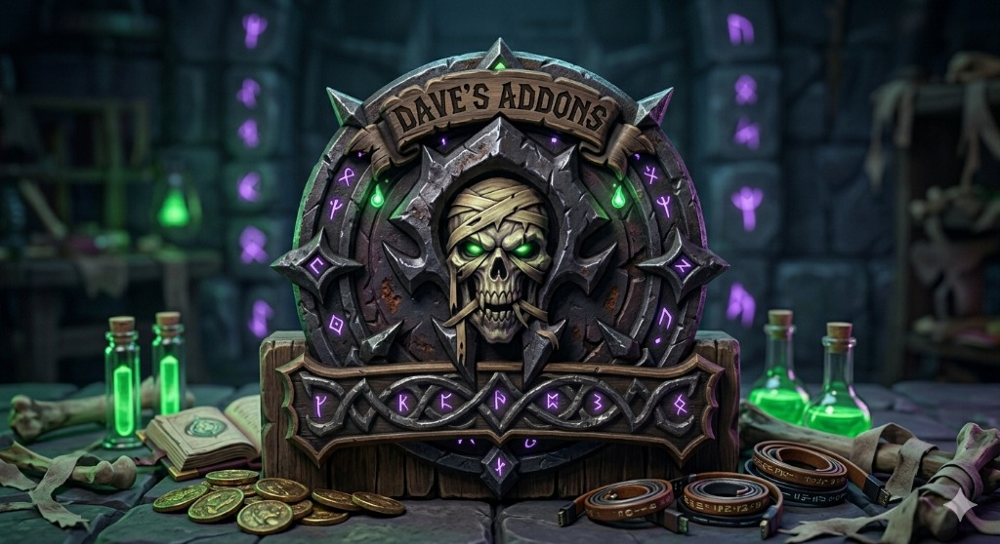

# Dave's UI & Quality-of-Life Addon Suite

**Hello, I'm Dave, a World of Warcraft player with a need for a clean UI and addons that work. When I'm not tweaking my addons and building helpful interface tools, you can find me in the game. I build addons to solve real needs and quality of life. Check out my projects, and feel free to reach out with feedback or feature requests!**

---

A lightweight, modular collection of quality-of-life addons designed to declutter your interface, streamline systems, and give you full control over your layout. Use them together for a unified experience or pick and choose the modules that fit your playstyle.

---

## 🛠️ Included Addons

### 💼 DavesBags
Cleans up inventory management with a modern, combined bag view.
* **Smart Viewing:** Defaults to a clean Category View, automatically grouping items by type (Consumables, Gear, Quest Items, etc.).
* **Memory:** Remembers your preferred view setting (Category vs. Slot) across play sessions.
* **Customization:** Automatic sorting, filtering, and customizable slot indicators.

### 💰 DavesAuctioner
A lightweight, lightning-fast custom Auction House scanning and posting tool.
* **Pricing Tooltips:** Displays accurate "Dave's AH Price" values directly on your item tooltips when you hover over items in your bags.
* **Smart Bag Scanner:** A custom "Scan Bags" button injected into the AH automatically queries and saves the value of only the items you actually own, preventing lag and throttling.
* **Dave's Sell Tab:** A custom interface tab injected into the AH that lets you drag and drop items from your bags, instantly calculates an undercut price, and provides a one-click posting button.

### 🗺️ DavesQuests
A highly interactive, draggable quest tracker window built as an alternative to the default objective tracker.
* **Smart Sections:** Quests automatically sort into "In Progress", "Completed", and "Active" sections.
* **Auto-Tracking:** Making progress on any objective automatically pins that quest to your "In Progress" section at the top of the list!
* **Clickable Quest Items:** Usable quest items dynamically appear as Secure Action Buttons directly on the quest card, letting you use them even while in combat.
* **Map Integration:** Clicking any quest POI on the World Map instantly highlights it and auto-pins it.
* **Custom Order:** Full drag-and-drop support so you can reorder your pinned quests to build custom routes.

### 🌿 DavesGather
Built for farmers and gatherers. 
* Tracks node locations and records gathering routes with beautiful, rounded map pins. 
* Includes a customizable filtering dropdown on both the standalone window and the World Map to easily toggle visibility for herbs, ore, cloth, and more.

### 📱 DavesMobileMenu
A sleek, central hub menu that packs beautifully against the screen edge, providing quick-access toggle buttons to open and close all of Dave's addons seamlessly.

### 🖼️ DavesMobileFrames
Unlocks default unit frames (player, target, focus, party) so you can drag, resize, lock, and reposition them absolutely anywhere on your screen.

### 📝 DavesNotes
A lightweight in-game notepad. Jot down coordinate notes, raid tactics, crafting checklists, or reminders without ever needing to alt-tab.

---

## ⚙️ Installation

1. Click the green **Code** button at the top of this repository and select **Download ZIP** (or clone via Git).
2. Extract the downloaded `.zip` file.
3. Copy the individual addon folders (`DavesBags`, `DavesAuctioner`, `DavesQuests`, etc.) into your game's addon directory:
   * *Path:* `World of Warcraft\_retail_\Interface\AddOns\` *(or `_classic_` depending on your version)*
4. Restart the game or type `/reload` if you are already logged in.
5. Confirm the addons are checked in your in-game **AddOns** menu at character select.

---

## ⌨️ Slash Commands

Each addon is designed to work out of the box with sensible defaults, but you can configure them using slash commands in chat:

| Addon | Slash Command | Primary Action |
| --- | --- | --- |
| **DavesAuctioner** | `/dauction` | Configure Auction House tooltips and settings. |
| **DavesBags** | `/dbags` | Open bag configuration, display filters, and sorting rules. |
| **DavesGather** | `/dgather` | Toggle gathering node overlays and filter settings. |
| **DavesMobileFrames** | `/dmf lock / unlock` | Toggle movement anchors to drag and position unit frames. |
| **DavesMobileMenu** | `/dmenu` | Toggle the master quick-access menu interface. |
| **DavesNotes** | `/dnotes` | Open the notepad window to create, edit, or delete notes. |
| **DavesQuests** | `/dquests` | Toggle the quest tracker window. |
